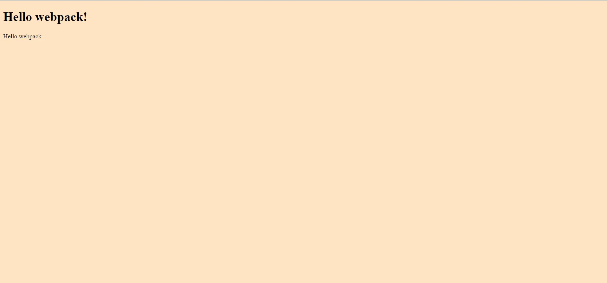

# 📖 Webpack-project
**webpack-project** is a project done for the activity "Set up project with webpack" of the Microverse Program. The goal is to learn to use webpack.
# Desktop Version View

## 🛠 Built With 
- HTML
- CSS
- JavaScript

### Key Features 

- **Use Webpack**
- **Use Custom Webpack Configuration**

(<a href="#readme-top">back to top</a>)

(<a href="#readme-top">back to top</a>)

## 👥 Authors 

👤 **Harshika Govind**

- GitHub: [@githubhandle](https://github.com/harshi0102)
- Twitter: [@twitterhandle](https://twitter.com/harshika0102me/)
- LinkedIn: [LinkedIn](https://www.linkedin.com/in/harshikagovind)

## ⭐️ Show your support 

Give a ⭐️ if you like this project!

(<a href="#readme-top">back to top</a>)
